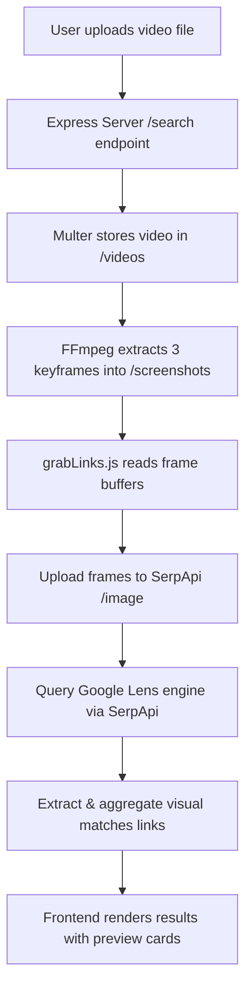

# 🎬 FrameCatch — Reverse Video Search

[](https://nodejs.org/)
[](https://expressjs.com/)
[](https://serpapi.com/)
[](https://ffmpeg.org/)
[](https://opensource.org/licenses/MIT)

> **Effortlessly discover the origins and visual matches of any video across the web.**

**FrameCatch** is a full-stack reverse video search web application. It allows users to upload video clips (MP4, WebM, MOV), automatically extracts representative keyframes using **FFmpeg**, and runs visual recognition across the web using **SerpApi's Google Lens engine** to return matching sources, social posts, and streaming video origins.

---

## 📑 Table of Contents

- [Features](#-features)
- [How It Works](#-how-it-works)
- [System Architecture](#-system-architecture)
- [Tech Stack](#-tech-stack)
- [Prerequisites](#-prerequisites)
- [Installation & Setup](#-installation--setup)
- [Environment Variables](#-environment-variables)
- [Running the Application](#-running-the-application)
- [API Reference](#-api-reference)
- [Project Structure](#-project-structure)
- [Roadmap & Enhancements](#-roadmap--enhancements)
- [Author & License](#-author--license)

---

## ✨ Features

- 📤 **Drag & Drop Upload**: Intuitive, responsive file uploader supporting MP4, WebM, and MOV formats up to 50MB.
- 🎞️ **Automated Keyframe Extraction**: Utilizes `fluent-ffmpeg` to sample keyframes from uploaded videos for precise visual queries.
- 🔍 **Google Lens Visual Matching**: Leverages SerpApi's Google Lens integration to perform deep visual searches across the internet.
- 🖼️ **Smart Thumbnail Previews**: Automatically generates high-resolution YouTube video thumbnails or high-quality site favicons/logos for visual confirmation.
- ⚡ **Concurrent Frame Search**: Executes searches across all extracted frames concurrently with `Promise.allSettled` for fast, resilient results.
- 🎨 **Modern Responsive UI**: Clean interface built with Material Symbols and custom CSS design tokens.

---

## 🔄 How It Works



1. **Upload**: The user drops a video file into the web UI or browses their filesystem.
2. **Keyframe Sampling**: The backend processes the video with FFmpeg, extracting 3 distributed screenshot frames (`320x240` resolution).
3. **Image Upload & Lens Search**: Extracted frames are uploaded directly to SerpApi and passed to the `google_lens` engine to find visual matches.
4. **Result Aggregation**: Matched URLs are aggregated, mapped, and returned as a JSON response.
5. **Interactive Display**: The frontend dynamically renders result cards with domain metadata, high-resolution thumbnails (YouTube/Favicon API), and direct source links.

---

## 🛠️ Tech Stack

### Backend
- **Runtime**: [Node.js](https://nodejs.org/) (ES Modules)
- **Framework**: [Express.js v5](https://expressjs.com/)
- **File Handling**: [Multer](https://github.com/expressjs/multer)
- **Media Processing**: [fluent-ffmpeg](https://github.com/fluent-ffmpeg/node-fluent-ffmpeg) / [FFmpeg](https://ffmpeg.org/)
- **Search Provider**: [SerpApi](https://serpapi.com/) (`google_lens` visual search engine)
- **Environment**: [dotenv](https://github.com/motdotla/dotenv)

### Frontend
- **Core**: Vanilla HTML5, CSS3, ES6+ JavaScript
- **Typography & Icons**: Google Fonts ([Inter](https://fonts.google.com/specimen/Inter)), [Material Symbols Outlined](https://fonts.google.com/icons)
- **Design System**: CSS Custom Properties / Design Tokens

---

## 📋 Prerequisites

Before running the application, make sure you have the following installed on your machine:

1. **Node.js** (v18.0.0 or higher recommended)
   - Verify: `node -v`
2. **FFmpeg** (Must be installed and added to your system's `PATH`)
   - **Windows** (via Scoop or Chocolatey):
     ```powershell
     choco install ffmpeg
     # or
     scoop install ffmpeg
     ```
   - **macOS** (via Homebrew):
     ```bash
     brew install ffmpeg
     ```
   - **Linux** (Debian/Ubuntu):
     ```bash
     sudo apt update && sudo apt install ffmpeg
     ```
   - Verify: `ffmpeg -version`
3. **SerpApi API Key**
   - Register for a free account at [SerpApi](https://serpapi.com/) to obtain your API key.

---

## 🚀 Installation & Setup

1. **Clone the repository:**
   ```bash
   git clone https://github.com/ZerceusDragov/reverse-video-search.git
   cd reverse-video-search
   ```

2. **Install dependencies:**
   ```bash
   npm install
   ```

3. **Configure Environment Variables:**
   Create a `.env` file in the root directory:
   ```env
   PORT=3000
   SERPAPI_KEY=your_serpapi_key_here
   ```

---

## ⚙️ Environment Variables

| Variable | Required | Default | Description |
| :--- | :---: | :---: | :--- |
| `SERPAPI_KEY` | **Yes** | — | Your SerpApi secret key for Google Lens visual search. |
| `PORT` | No | `3000` | The port on which the Express server listens. |

---

## 🏃 Running the Application

### Development Mode (with Node.js File Watcher)
```bash
npm start
```
*Runs `node --watch server.js` to automatically reload on code changes.*

### Open in Browser
Visit [http://localhost:3000](http://localhost:3000) in your web browser.

---

## 📡 API Reference

### `POST /search`

Uploads a video and performs reverse visual search across extracted frames.

- **Content-Type**: `multipart/form-data`
- **Body Parameter**:
  - `video` (File): Video file (`.mp4`, `.webm`, `.mov`, max 50MB).

#### Example Request:
```bash
curl -X POST http://localhost:3000/search \
  -F "video=@/path/to/sample_video.mp4"
```

#### Example Response (`200 OK`):
```json
{
  "list": [
    "https://www.youtube.com/watch?v=dQw4w9WgXcQ",
    "https://vimeo.com/123456789",
    "https://www.reddit.com/r/videos/comments/..."
  ]
}
```

#### Error Response (`400 Bad Request` / `500 Internal Server Error`):
```json
{
  "error": "No video file uploaded."
}
```

---

## 📁 Project Structure

```
reverse-video-search/
├── grabLinks.js            # SerpApi image upload and Google Lens visual search module
├── package.json            # Node.js dependencies and scripts
├── package-lock.json       # Dependency lockfile
├── server.js               # Express application and FFmpeg frame extractor
├── .env                    # Environment variables (API keys, PORT)
├── .gitignore              # Ignored files (node_modules, logs, cache)
├── public/                 # Static frontend assets served by Express
│   ├── index.html          # Main application page (hero, dropzone, how-it-works)
│   ├── index.js            # Client-side logic (drag-drop, upload handler, UI rendering)
│   ├── searchresults.html  # Mockup template for search results layout
│   └── style.css           # Styling rules and design tokens
├── screenshots/            # Directory holding temporarily generated keyframes (.png)
└── videos/                 # Directory holding temporarily uploaded video files
```

---

## 🗺️ Roadmap & Enhancements

- [ ] **Search by Video URL**: Add support for direct video streaming links (YouTube, TikTok, direct MP4 URLs).
- [ ] **Automated File Cleanup**: Periodic cron/queue cleanup for processed video files and screenshots in `videos/` and `screenshots/`.
- [ ] **Intelligent Keyframe Selection**: Scene-change detection (using FFmpeg `select='gt(scene,0.4)'`) instead of fixed frame counts.
- [ ] **Expanded Search Engines**: Add multi-engine visual fallback (e.g. Bing Visual Search, Yandex, TinEye).
- [ ] **Match Metadata Enrichment**: Extract page title, snippet, and confidence score directly from SerpApi response payload.

---

## 👤 Author

- **Maximus Cortex**

---

## 📄 License

This project is licensed under the [MIT License](https://opensource.org/licenses/MIT).

